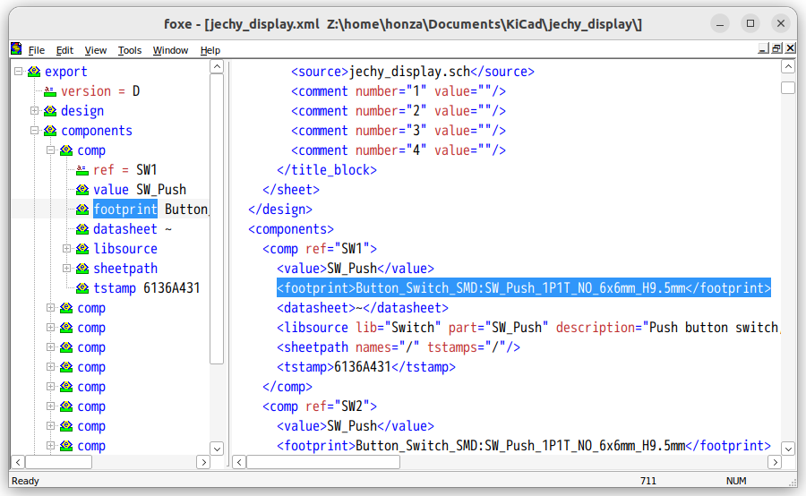

<h1 align="center">
  
  <br />
  firstobject XML Editor
</h1>

<p align="center"><b>This is the snap for firstobject XML Editor</b></p>

<p align="left">Firstobject's free XML editor for Windows is called foxe. It loads big files (multi-megabyte) fast and lets you format XML and edit HTML and any loosely formed XML or other markup. The tree view is editable and customizable for useful navigation.
</p>

<p align="right">-- part of official description, <a href="https://www.firstobject.com/dn_editor.htm">https://www.firstobject.com/dn_editor.htm</a></p>


## Build
```
sudo snap install snapcraft --classic
git clone https://github.com/HonzaCZ/foxe-snap.git
cd foxe-snap
snapcraft
```


## Install
```
sudo snap install --devmode foxe-wine_2.4.2_multi.snap
```

([Don't have snapd installed?](https://snapcraft.io/docs/core/install))


